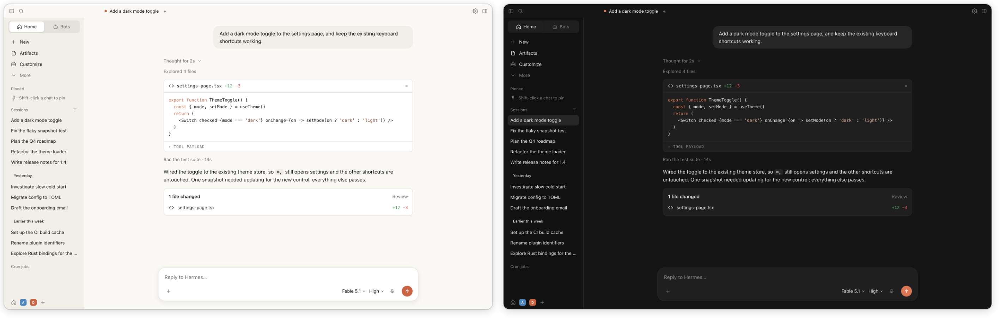
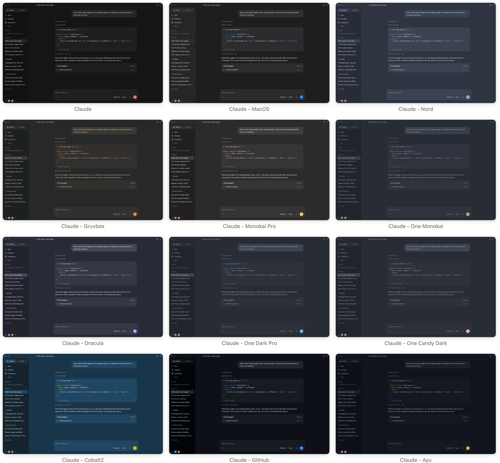

# Claude Skin for Hermes Desktop

Makes [Hermes Desktop](https://github.com/NousResearch/hermes-agent) read like the Claude desktop app: cream light palette, near-black dark palette, terracotta accent, centered reading column, rounded composer. Eleven more editor palettes ride on the same layout. One file, no rebuild.



## What it does

- **A `Claude` theme** in Settings ▸ Appearance, plus `Claude - MacOS`, `Claude - Nord`, `Claude - Gruvbox`, `Claude - Monokai Pro`, `Claude - One Monokai`, `Claude - Dracula`, `Claude - One Dark Pro`, `Claude - One Candy Dark`, `Claude - Cobalt2`, `Claude - GitHub` and `Claude - Ayu`. Light/dark follows macOS.
- **The Claude layout** while any of those themes is active: a simple left nav with recents (no timestamps or token counts), a centered 48rem chat column, right-aligned user bubbles, a two-row rounded composer with a terracotta send button, the status bar and file rail tucked away, and a serif "Good evening" on an empty chat.
- **A `More` row** in the sidebar. New, Artifacts and Customize stay visible; Messaging, Scheduled, Memory, Kanban and plugin rows fold under it. Open/closed is remembered.
- **Nothing is patched.** The plugin registers a theme and injects a stylesheet scoped to that theme. Pick another theme, or disable the plugin, and Hermes is exactly what it was.

## Themes



| Theme | Modes | Preview |
| --- | --- | --- |
| Claude | light + dark | [light](docs/previews/claude-light.png) · [dark](docs/previews/claude-dark.png) |
| Claude - MacOS | light + dark | [light](docs/previews/mac-light.png) · [dark](docs/previews/mac-dark.png) |
| Claude - Nord | light + dark | [light](docs/previews/nord-light.png) · [dark](docs/previews/nord-dark.png) |
| Claude - Gruvbox | light + dark | [light](docs/previews/gruvbox-light.png) · [dark](docs/previews/gruvbox-dark.png) |
| Claude - Monokai Pro | dark | [dark](docs/previews/monokai-pro-dark.png) |
| Claude - One Monokai | dark | [dark](docs/previews/one-monokai-dark.png) |
| Claude - Dracula | light + dark | [light](docs/previews/dracula-light.png) · [dark](docs/previews/dracula-dark.png) |
| Claude - One Dark Pro | dark | [dark](docs/previews/one-dark-pro-dark.png) |
| Claude - One Candy Dark | dark | [dark](docs/previews/one-candy-dark-dark.png) |
| Claude - Cobalt2 | dark | [dark](docs/previews/cobalt2-dark.png) |
| Claude - GitHub | light + dark | [light](docs/previews/github-light.png) · [dark](docs/previews/github-dark.png) |
| Claude - Ayu | light + dark | [light](docs/previews/ayu-light.png) · [dark](docs/previews/ayu-dark.png) |

Dark-only editor themes use their palette in both light and dark mode. Previews are rendered from the plugin's own palettes on a mock of the Hermes layout, so what you see in the app may differ in small ways.

## Install

You need a Hermes Desktop build with runtime desktop plugins (Capabilities ▸ Plugins). Pick one:

**From inside Hermes.** Capabilities ▸ Plugins ▸ *Install from Git*, paste `ottoRothmund/hermes-claude-skin`, install.

**With git.**

```bash
git clone https://github.com/ottoRothmund/hermes-claude-skin.git ~/.hermes/desktop-plugins/claude-skin
```

**By hand.** Download `plugin.js` and put it at `~/.hermes/desktop-plugins/claude-skin/plugin.js`.

Hermes watches that folder, so the plugin loads on the spot. No restart, no build step.

### First run

The desktop stores theme and light/dark mode per profile. The first time each profile is active with the plugin enabled, the plugin switches it to `Claude`, sets mode to *System*, and closes the right file rail once. After that it never touches your choices. (Remembered in plugin storage as `setup:<profile>`.)

## Using it

- **Switch theme.** Settings ▸ Appearance, or press <kbd>⌘K</kbd> and type `Theme: Claude - Nord`. Every theme is a palette command.
- **Light or dark.** Follows macOS by default. Change it in Settings ▸ Appearance.
- **The greeting.** An empty chat says "Good morning / afternoon / evening". Set `GREETING_NAME` at the top of `plugin.js` to add your name.
- **Sessions, Bots and Terminal tabs** are tucked away. Hover the top band of the sidebar to reveal them.
- **File rail.** Hidden by the first-run setup; the titlebar's *Show right sidebar* button brings it back.
- **Status bar** stays hidden while a Claude theme is active.
- **Turning it off.** Pick any non-Claude theme (the layout CSS is scoped to `html[data-hermes-theme^="claude"]`), or disable the plugin in Capabilities ▸ Plugins, which removes the themes too.

## Customize

Everything lives in `plugin.js`, and every save hot-reloads.

- `GREETING_NAME` — the name in the greeting. Empty by default.
- `light` / `dark` — the Claude palette.
- `PALETTES` — the other themes, one row each: slug, label, description, light palette, dark palette. A palette names eight colors and `expand()` fills the rest:

  ```js
  ['rose-pine', 'Rosé Pine', 'Dawn / Main',
    { bg: '#FAF4ED', sidebar: '#F2E9E1', card: '#FFFAF3', bubble: '#F2E9E1', fg: '#575279', muted: '#797593', border: '#DFDAD9', primary: '#D7827E', danger: '#B4637A' },
    { bg: '#191724', sidebar: '#1F1D2E', card: '#26233A', bubble: '#26233A', fg: '#E0DEF4', muted: '#908CAA', border: '#393552', primary: '#EBBCBA', danger: '#EB6F92' }],
  ```

  For a dark-only theme, wrap one palette in `...darkOnly({ … })`. Rows appear in Settings in the order listed.
- `CSS` — the layout, grouped by area. `--composer-width` is the reading column; `--conversation-text-font-size` and `--dt-line-height` set the transcript type.

## How it works

Two halves. The themes are registered through the `THEMES_AREA` contribution of the Hermes plugin SDK, so they sit next to the built-ins. The layout is one stylesheet, injected on load and scoped to `html[data-hermes-theme^="claude"]`, so it switches off with the theme. A small `More` row and a titlebar search button are added to the DOM and removed when the plugin is disposed.

## Troubleshooting

- **No Claude themes in Settings.** Check Capabilities ▸ Plugins: the plugin should be listed and enabled. If it shows an error, open `~/.hermes/logs/desktop.log` and look for `claude-skin`.
- **A profile did not switch to Claude.** Each profile runs the first-run setup the first time it is active. Open that profile once, or pick the theme by hand.
- **Layout looks stock.** The layout only applies while a Claude theme is selected for the active profile.

## Contact

Questions, bugs, theme requests: [@djbumpstock on X](https://x.com/djbumpstock) or open an issue.

## License

[MIT](LICENSE) © 2026 Otto Rothmund
